<div align="center">
  <div style="display: flex; align-items: flex-start;">
    
    <h1>Guía de Instalación de Arch Linux en Español</h1>
  </div>
</div>

Arch Linux es una distrubución de GNU/LINUX que sigue un modelo de lanzamiento
contínuo <<<i>Rolling Release</i>>>, esto quiere decir que el sistema se actualiza continua, sin interrupciones, con pequeñas actualizaciones. Todo esto implica que no existen versiones de Arch como de Ubuntu por ejemplo, que tiene lanzamientos completos cada tanto.
<br>
Además la instalación deja únicamente lo estrictamente necesario para funcionar. Y este proceso puede ser complejo, por eso elaboré esta guía de la forma más sencilla posible intentando explicar
qué hace cada cosa.
<br>
Para el seguimiento de esta guía se asume que se conocen los comandos básicos de Linux así como también un conocimiento básico sobre grupos, usuarios,
permisos, manejo de particiones, file system, archivos e inglés básico.

<br>
<br>

<!-- Index -->

# Índice

- [Índice](#índice)
- [Disclaimer](#disclaimer)
- [Guía Oficial](#guía-oficial)
- [Antes de Empezar](#antes-de-empezar)
  - [Instalación en Hardware](#instalación-en-hardware)
  - [Instalación sobre una Máquina Virtual](#instalación-sobre-una-máquina-virtual)
- [Preparación del medio de instalación](#preparación-del-medio-de-instalación)
- [Preparando la instalación](#preparando-la-instalación)
  - [Configuración de Teclado](#configuración-de-teclado)
  - [Conectándonos a internet](#conectándonos-a-internet)
  - [Configurando la fecha y hora](#configurando-la-fecha-y-hora)
- [Creando las Particiones](#creando-las-particiones)
  - [Explicación breve](#explicación-breve)
  - [Preparando las particiones](#preparando-las-particiones)
  - [Ahora sí, creamos las particiones](#ahora-sí-creamos-las-particiones)
  - [Formateando y Montando las particiones](#formateando-y-montando-las-particiones)
- [Configurando los mirrors](#configurando-los-mirrors)
- [Ahora sí. Instalamos el sistema](#ahora-sí-instalamos-el-sistema)
- [Generando el archivo fstab](#generando-el-archivo-fstab)
- [Configurando el sistema](#configurando-el-sistema)
- [Instalando Programas](#instalando-programas)
- [Creando el usuario](#creando-el-usuario)
- [Instalando Network Manager](#instalando-network-manager)
- [Instalando GRUB](#instalando-grub)
- [Conectándonos a Internet (de nuevo)](#conectándonos-a-internet-de-nuevo)
- [Comandos útiles](#comandos-útiles)
- [Instalando Yay](#instalando-yay)
- [Instalando un Entorno de Escitorio](#instalando-un-entorno-de-escitorio)
  - [KDE Plasma](#kde-plasma)

<br>

# Disclaimer

La siguiente guía no tiene garantía alguna. Sos completamente responsable de las acciones que harás a continuación
y corrés el riesgo de perder todos los datos si no procedés con precaución.
Leé 2 veces cada comando antes de ejecutarlo y prestá atención a todo lo que el Sistema Operativo devuelve ante cada
comando. Si pasa que la instalación toma otro rumbo desconocido, ya sea por algun error o cambio en la instalación,
lo mejor es googlear en busca de la solución.

<br>

# Guía Oficial

Es altamente recomendable tener siempre a mano la [guía oficial de instalación de Arch Linux en inglés](https://wiki.archlinux.org/title/installation_guide) que tendrá todos los últimos cambios que se hayan hecho sobre
la instalación así como también todas las cosas que haya que tener en cuenta ante situaciones específicas.

<br>

# Antes de Empezar

## Instalación en Hardware

Si estás en Windows y querés mantener el sistema operativo para poder entrar tanto a Windows como a Arch Linux, es
conveniente que dejes una parte del disco sin asignar para poder instalar ahí Arch Linux. Si bien no es necesario
mucho espacio para instalarlo es conveniente pensar de antemano cuánto espacio vas a necesitar.
<br>
Unos 80GB estarían bien, aunque todo depende de para que vayas a utilizar el sistema. Este particionado te recomendamos que lo hagas desde Windows, porque Linux y Windows suelen llevarse como perro y gato.
<br>
Agarrá un lapiz y un papel y anotá el tamaño de cada partición de tu disco duro. Es probable que lo necesites más
adelante.
<br>


## Instalación sobre una Máquina Virtual

Si vas a realizar esta instalación sobre una máquina virtual, lo conveniente es que averigues la forma en la que se puede iniciar la máquina en modo UEFI.
En caso de que utilices una máquina VMWare, esto se logra añadiendo la siguiente línea al archivo .vmx de la vm:
<br>
`
  firmware = "efi"
`
<br>
Otros softwares de máquinas virtuales tienen otras formas muy distintas de entrar en modo UEFI y algunos incluso no pueden hacerlo, por lo que dejamos esto en tus manos.
Dicho esto, empecemos.


# Preparación del medio de instalación

Bien, lo primero y principal es la preparación del dispositivo booteable con la imagen del sistema que vamos a instalar. Para eso hay que descargarlo desde [la página oficial de Arch Linux](https://www.archlinux.org/download/) y mediante un software como [Rufus](https://rufus.ie/en/) y grabarlo en modo GPT para sistemas UEFI en una USB.
<br>
Luego hay que reiniciar la PC y seleccionar como medio de arranque el USB accediendo a la BIOS.

<br>


# Preparando la instalación

Si todo fue bien, habrás llegado a una pantalla como la siguiente:

  <div align="center">
    
  </div>

Ahora mismo nos encontramos en un mini Sistema Operativo cargado desde el USB en la Memoria RAM de nuestra
computadora que nos servirá para poder realizar la instalación y será tu ángel guardián, nunca lo borres porque es desde donde podés solucionar gran parte de los problemas que no te permitan acceder a Linux.


## Configuración de Teclado
  
Si te ganó la curiosidad y empezaste a escribir algo, te habrás dado cuenta que el teclado está distinto, y si no
probá escribir una `ñ` o un `-` y vas a ver que no te hace caso y pone lo que se le da la
gana.
<br>
Esto es porque por defecto el teclado viene con el layout estadounidense y tenemos que cambiarlo para poder estar
cómodos con nuestro teclado. Para eso necesitamos saber en dónde vivimos (?) y qué layout corresponde.
<br>
Esta configuración tendrá efecto sólamente durante la instalación, luego veremos cómo hacerlo en el sistema instalado.

<br>

**TL;DR**
<br>
Si estás en latinoamérica el comando que tenés que ejecutar es el siguiente:

```sh
loadkeys la-latin1
```

Y para ahorrarte el trabajo, el `-` está en el lugar del `?`.
<br>
Para España (tu teclado probablemente tenga alguna tecla como esta: `Ç`) el comando será:

```sh
loadkeys es
```

Y así se puede volver al teclado estadounidense:
<br>

```sh
loadkeys us
```

**Para los curiosos**

Las distribuciones disponibles para setear las podemos listar con el comando:

```sh
ls /usr/share/kbd/keymaps/**/*.map.gz
```

y veremos algo como lo siguiente:

  <div align="center">
    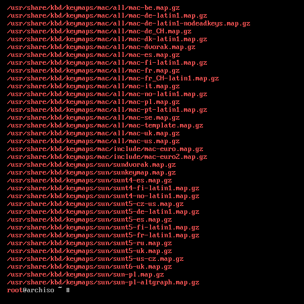
  </div>


Como evidentemente no entran en la pantalla, podemos copiarlos todos en un archivo y verlos más tranquilamente con:

```sh
ls /usr/share/kbd/keymaps/**/*.map.gz > /tmp/keymaps.txt
nano /tmp/keymaps.txt
```

O también podemos pasarle el comando mediante una pipe a less, que formatea el output de un comando de forma en que podamos desplazarnos más cómodamente:

```sh
ls /usr/share/kbd/keymaps/**/*.map.gz | less
```

Teniendo ya el teclado configurado podemos continuar con la instalación.


## Conectándonos a internet

Si estás conectado por cable esto no te va a tomar mucho tiempo, podés probar hacer:

```sh
ping -c 5 archlinux.org
```

Y habrás obtenido algo similar a esto:

  <div align="center">
    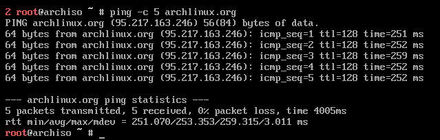
  </div>

<br>
En ese caso podés continuar a la siguiente sección. Sino quedate que vamos a configurar el WiFi.
<br>
El instalador de Arch Linux viene con una herramienta que nos va a servir para conectarnos al WiFi durante la
instalación que se llama `iwd` que se ejecuta como daemon (proceso en segundo plano) y que se configura con el comando:

```sh
iwctl
```

Así habrás entrado a una consola interactiva en donde podemos escribir los comandos para conectarnos al WiFi.
Para ver los adaptadores de red conectados ejecutamos:

```sh
device list
```

Por ejemplo, podría aparecer como dispositivo `wlp1s0` o `wlan0` o similar.
Y para ver las redes disponibles ejecutamos:

```sh
station wlan0 scan
station wlan0 get-networks
```

Reemplazá `wlan0` por el nombre del dispositivo que vas a usar.
<br>
Luego de ver las redes disponibles vamos a conectarnos.
<br>
Supongamos que la red se llama `Batman` y la contraseña es `B4timovil`.
<br>
Entonces nos conectamos con el siguiente comando:

```sh
station wlan0 connect Batman
## Nos va a pedir la contraseña y pondremos
B4timovil

## Para salir escribimos el 
## siguiente comando o apretamos Ctrl + C.
exit
```

Ahora probá hacer un `ping` como mostré antes y podemos continuar con la instalación.
<br>
Si tu placa de red no encontró ninguna red para conectarse, o tuviste problemas para conectarte te recomiendo que te
conectes al modem por cable y sigas así con la instalación. Es probable que luego de la instalación del sistema, los
paquetes que instalemos te permitan conectarte al WiFi.


## Configurando la fecha y hora

Ahora que tenemos nuestro instalador conectado a internet, vamos a configurar la fecha y hora.<br>
Para eso tenemos una herramienta que nos permite consultar o modificar la fecha y hora del sistema que es
`timedatectl` y lo vamos a hacer así:

```sh
timedatectl set-ntp true
```

Con este comando ya le decimos que use internet para sincronizar la fecha y la hora.<br>
Para comprobarlo podemos usar el comando:

```sh
timedatectl status
```


# Creando las Particiones

*Ahora sí se viene lo chido...* diria Luisito Comunica. <br>
Ya que tenemos la instalación del sistema preparada, vamos a crear las particiones que vamos a necesitar.
<br>
Si ya tenés Windows instalado, entonces ya hay particiones hechas que <b>NO TENES QUE TOCAR</b>. Entre ellas la EFI
Partition y la partición de Windows (El disco C digamos...).
<br>
En mi caso no tengo Windows instalado y crearé las particiones de cero, pero vos ya tendrás 2 o más particiones
asignadas.
<br>
Para listar los discos y particiones que tenemos usamos el siguiente comando:

```sh
lsblk
```

Si estás en una Máquina virtual o haciendo una instalación limpia habrás visto algo como lo siguiente:

<div align="center">
  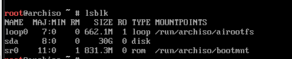
</div>

En cambio si estás instalando en una PC con windows instalado habrás visto algo más similar a lo siguiente:

<div align="center">
  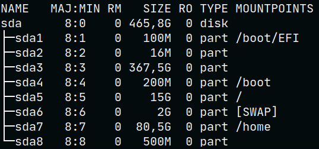
</div>

O a lo siguiente:

<div align="center">
  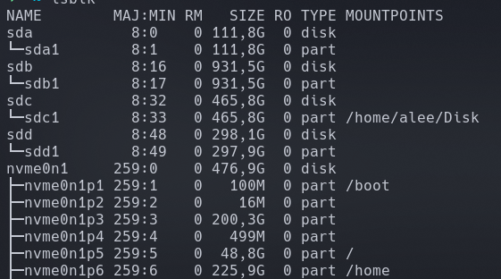
</div>


## Explicación breve

Los discos instalados los vamos identificar por verse como `sda`, `sdb`, etc. O en el caso de
nvme (que es una unidad de almacenamiento ultra rápida) se ven como `nvme0n1`.
<br>
El primer disco lo vamos a ver como sda, el segundo como sdb, y así sucesivamente.
<br>
Al mismo tiempo, cada disco puede tener sus particiones, por ejemplo, `sda1`, `sda2`,
`sdb1`, `sdb2`, etc.
<br>
Cada partición puede organizarse internamente de distintas formas, que son los distintos File Systems. Por ejemplo
el File System por defecto de Windows es NTFS, el de un PenDrive es Fat32 y el de Linux ext4. Y cada File System
puede montarse en la ubicación que deseemos. En el ejemplo vemos que mi partición `nvme0n1p6` está
montada en `/home` o en el caso de la Máquina Virtual el único volumen `sda` no está montado
en ningún lugar.


## Preparando las particiones

Vamos a crear algunas particiones para instalar Arch Linux que van a ser las siguientes:


- EFI Partition
  >Si tenés Windows instalado, esta partición ya existe y no tenés que tocarla porque sino puede que Windows no arranque.<br> En esta partición están los archivos necesarios para que el Sistema Operativo arranque. <br> Si vas a instalar Arch Linux solo, o en una Máquina Virtual, vamos a asignarle unos 550MiB de espacio.
  

- Root
  > La partición root la vamos a montar en `/` y la vamos a formatear como `ext4`.<br> Acá vamos a instalar el Sistema Operativo y todos los programas.<br> Si estás instalando sobre una PC real necesita tener por lo menos unos 25Gb de espacio (aunque puede ser más, en mi caso he necesitado hasta 50Gb).


- Swap
  >La partición SWAP no tiene punto de montaje ni File System.<br> Es una partición que sirve para que el Sistema Operativo envíe los procesos que no se están ejecutando actualmente sobre todo en equipos con poca Memoria RAM.<br> Por regla general si tenés hasta 2GB de Ram es recomendable usar 4GB de Swap. <br>A partir de 4GB de Ram es conveniente tener no más de 4GB de Swap. <br> Si tenés una cantidad exagerada de ram podés omitir esta partición.


- Home
  >La partición HOME la vamos a montar en `/home` y la vamos a formatear como `ext4` también.<br> Acá van a estar todos los archivos personales (por ejemplo todo lo que está en el escritorio, la carpeta de descargas, fotos, videos, configuraciones, etc).<br> Vamos a asignarle todo el resto del espacio que nos sobre.

<br>

## Ahora sí, creamos las particiones

Después de tanto blabla vamos a ejecutar el siguiente comando para crear las particiones:

```sh
cfdisk
```

Si nos pregunta qué tipo de tabla de particiones queremos le decimos que vamos a usar GPT. <br>
Hasta este punto tendremos algo similar a esto:

<div align="center">
  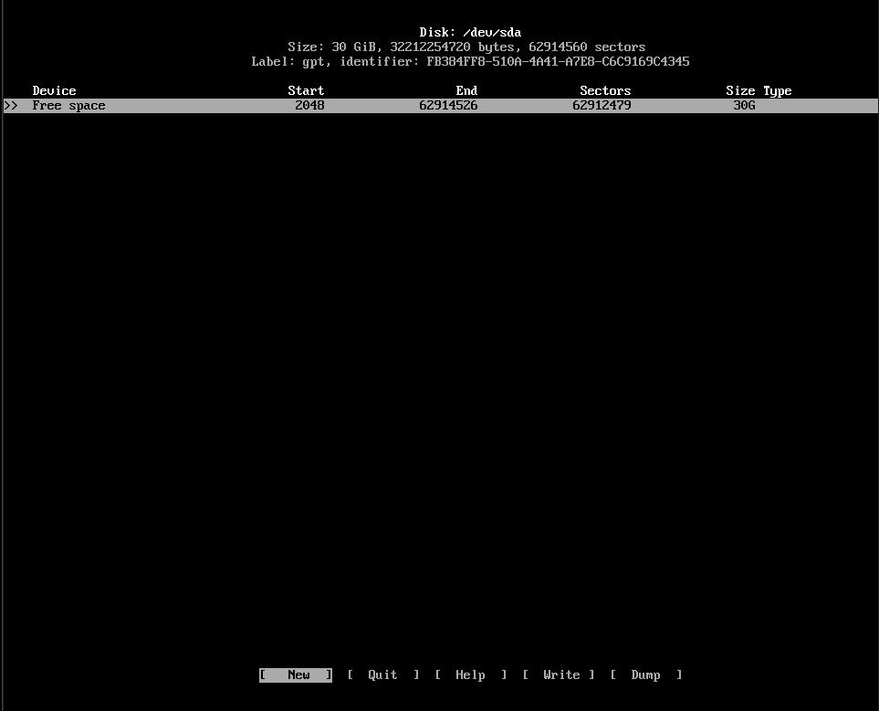
</div>

<br>

Si tenés windows instalado es <b>CLAVE</b> que no toques las particiones que ya están hechas y nos vamos a enfocar en aquellas que dicen `Free Space`.
<br>
Acá te podés mover con las flechas hacia arriba y abajo para seleccionar la partición, o izquierda y derecha para seleccionar una opción.
<br>
Si nos paramos en `Free Space` y seleccionamos `[New]` nos preguntará el espacio que le queremos asignar y vamos poner lo que ya anotamos antes, en mi caso voy a instalarlo en un disco de 120GB y lo voy a hacer de la siguiente manera:

- 550MiB para EFI Partition
- 4G para Swap
- 25G para Root
- 90G para Home

Prestá atención a cómo escribí las dimensiones.
<br>
Y con si seleccionamos `[Type]` vamos a poder seleccionar el tipo.

- EFI System para la EFI Partition
- Linux Root (x86-64) para Root
- Linux Home para Home
- Linux Swap para la Swap

Sacale foto a como quedó, lo vas a necesitar. A mí me quedó algo así:

<div align="center">
  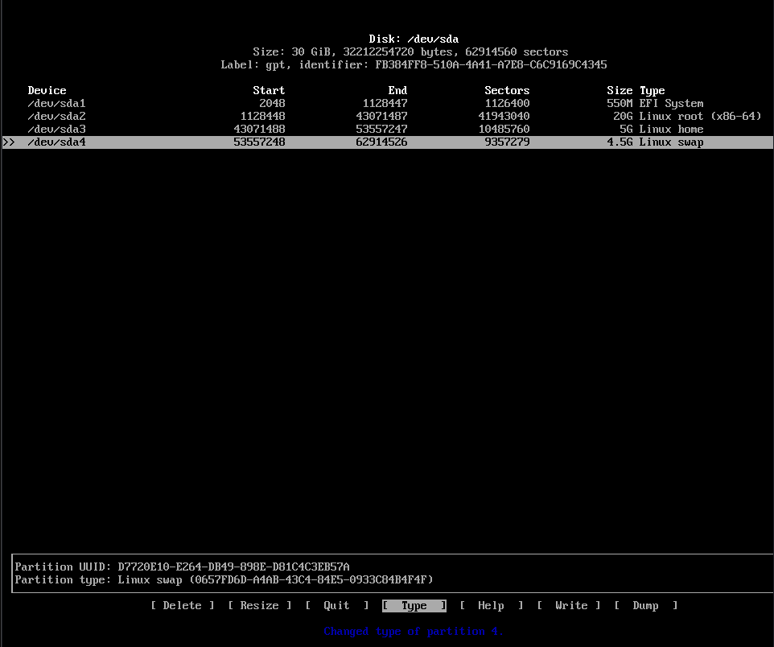
</div>

<br>

Entonces nos queda:
- `/dev/sda1` para EFI Partition
- `/dev/sda2` para Swap
- `/dev/sda3` para Root
- `/dev/sda4` para Home
  
Finalmente le damos a `[Write]`, confirmamos la operación y salimos con `[Quit]`.


## Formateando y Montando las particiones

Vamos a formatear y montar las particiones que acabamos de crear.
<br>
Como dijimos, vamos a usar ext4 como File System y vamos a formatear las particiones de Root y de Home con ese File System:

```sh
mkfs.ext4 /dev/sda3
mkfs.ext4 /dev/sda4
```

Ahora toca formatear la partición EFI. <b>SOLAMENTE SI LA ACABÁS DE CREAR SINO NO EJECUTES ESTE COMANDO</b>.

```sh
mkfs.fat -F32 /dev/sda1
```

Por último queda formatear la partición de Swap.

```sh
mkswap /dev/sda2
```

Ahora queda montar las particiones que creamos sobre el File System del instalador para poder instalar sobre ellas el Sistema Operativo.
<br>
Lo haremos de la siguiente manera:

```sh
mount /dev/sda3 /mnt # Montamos Root sobre /mnt

mkdir /mnt/home # Creamos la carpeta Home
mount /dev/sda4 /mnt/home # Montamos Home sobre /mnt/home

mkdir /mnt/boot # Creamos la carpeta Boot
mount /dev/sda1 /mnt/boot # Montamos la partición EFI sobre /mnt/boot

swapon /dev/sda2 # Activamos Swap
```

Y con esto ya tenemos creadas las particiones y montadas sobre el File System del USB para poder instalar el sistema.
<br>
Luego si querés saber cómo quedaron las particiones podés usar este comando:

```sh
fdisk -l
```

  <div align="center">
    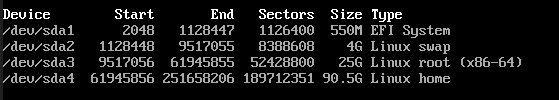
  </div>


# Configurando los mirrors

Los paquetes que instalamos se descargan de servidores que están repartidos por todo el mundo, hay un archivo que ahora vamos a revisar, que tiene en orden de prioridad descendente cada uno de los servidores. Normalmente ya viene configurado con los mirrors más rápidos para nuestra ubicación. Lo podemos ver con el siguiente comando:

```sh
cat /etc/pacman.d/mirrorlist
```

<br>
<div align="center">
  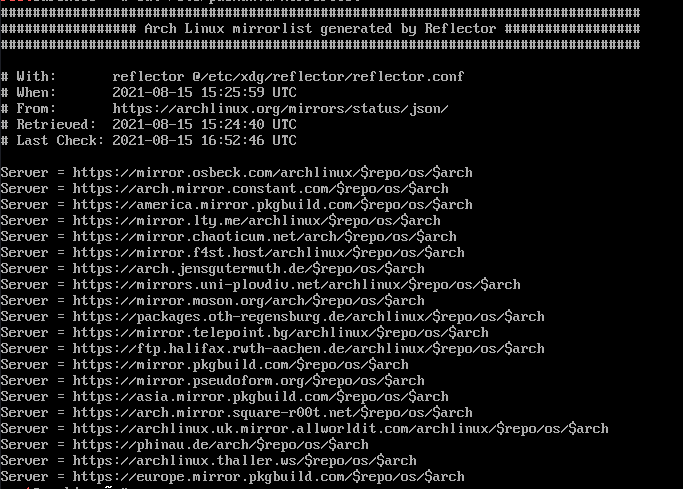
</div>

Si ves algo como lo de la imagen, entonces ya podés continuar a la próxima sección, si no, quedate que los vamos a configurar.
<br>
Vamos a usar `reflector` que es una herramienta que se va a encargar de probar todos los servidores actualizados y meterlos en el archivo mirrorlist ordenados según la velocidad. Lo haremos con el siguiente comando:

```sh
cp /etc/pacman.d/mirrorlist /etc/pacman.d/mirrorlist.bak ## Creamos un Backup por las dudas
reflector --verbose --latest 5 --save /etc/pacman.d/mirrorlist ## Hacemos la magia
cat /etc/pacman.d/mirrorlist ## Comprobamos que se han añadido los servidores

## Y si algo salió mal:
cp /etc/pacman.d/mirrorlist.bak /etc/pacman.d/mirrorlist ## Levantamos el backup.

## Sino ya podemos borrar el backup
rm /etc/pacman.d/mirrorlist.bak
```


# Ahora sí. Instalamos el sistema

Para instalar el sistema, el instalador de Arch Linux nos provee de una herramienta llamada `pacstrap` y lo vamos a usar de la siguiente manera:

```sh
pacstrap /mnt base base-devel linux linux-firmware
```

Puede que tarde un rato, mientras se instala te cuento que esta herramienta va a usar los servidores que configuramos hace un ratito y va a descargar el sistema e instalarlo sobre `/`, te acordás que lo montamos en `/mnt` ¿no?. <br>
Luego usaremos otra herramienta llamada `pacman` para instalar los paquetes.
<br>
Bien. Ya tenemos Arch Linux instalado, pero esto todavía no termina. Nos vemos en la próxima sección.


# Generando el archivo fstab

¿Te acordás que hace un rato montamos las particiones a mano con el comando `mount`? <br>
Bien, hacer eso todo el tiempo es insano, por eso el Sistema Operativo tiene un archivo con la tabla de File Systems y se encarga de automatizar el proceso. Para generar ese archivo hacemos:

```sh
genfstab -U /mnt >> /mnt/etc/fstab
```

Y si por curiosidad queremos verlo podemos hacer:

```sh
cat /mnt/etc/fstab
```

Se vería algo así:

<div align="center">
  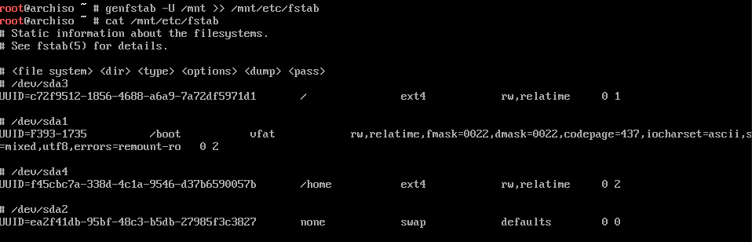
</div>


# Configurando el sistema

Lo primero es movernos al Root de nuestra máquina que creamos hace un rato y donde instalamos el sistema operativo:

```sh
arch-chroot /mnt
```

<br>
Para definir la zona horaria vamos a crear un Soft Link de nuestra región+ciudad.
<br>

Para ver qué regiones hay disponibles lo hacecmos con:

```sh
ls /usr/share/zoneinfo/
```

Y si queremos ver qué ciudad hay para una región tenemos que hacer:

```sh
ls /usr/share/zoneinfo/America/
```

Finalmente lo seteamos:

```sh
ln -s /usr/share/zoneinfo/America/Buenos_Aires /etc/localtime
```

Para configurar la hora usamos hwclock que va a generar el archivo `/etc/adjtime`:

```sh
hwclock --systohc
```

<br>

Ahora toca configurar el idioma.
Para ver los idiomas disponibles podemos ver el archivo haciendo:

```sh
cat /etc/locale.gen
```

Sí, ya se, no entran en la pantalla. Para ver los que nos interesan podemos usar:

```sh
cat /etc/locale.gen | grep -E "en|es" | grep UTF
```

Elegimos uno (o alguno) de esos. Y hacemos lo siguiente. En mi caso voy a seleccionar inglés de Estados Unidos y español de Argentina, pero vos podes seleccionar el que más te guste.

```sh
echo "en_US.UTF-8" >> /etc/locale.gen
echo "es_AR.UTF-8" >> /etc/locale.gen
```

Y generamos los archivos de localización con:
  
```sh
locale-gen
```

Si querés ver el idioma seteado podés hacer:

```sh
locale
```

Y si querés cambiar el idioma podés hacer:

```sh
localectl set-locale LANG=en_US.UTF-8
```

<br>

Ahora seteamos el layout del teclado (si, de nuevo, pero ahora en el Sistema Operativo instalado)

```sh
echo "KEYMAP=la-latin1" > /etc/vconsole.conf
```

<br>

Tenemos que definir un nombre para el equipo. El mío se va a llamar `archvm` y lo hacemos de la siguiente manera:

```sh
echo "archvm" > /etc/hostname
```

<br>

Bien, ahora tenemos que definir el archivo `/etc/hosts`.
<br>
Nos va a permitir mapear algunos alias a algunas IP's específicas.
<br>
De esta manera, por ejemplo, vamos a poder usar `localhost` para referirnos a nuestro equipo.
<br>
Reemplazá `archvm` por el nombre de tu equipo.<br>
Revisá que esté todo bien copiado


```sh
echo "127.0.0.1\tlocalhost" >> /etc/hosts
echo "::1\t\tlocalhost" >> /etc/hosts
echo "127.0.1.1\tarchvm.localhost archvm" >> /etc/hosts
```

Tuvo que haber quedado algo así:

```sh
cat /etc/hosts
```

  <div align="center">
    
  </div>

<br>

Con esto ya terminamos la parte más pesada de la instalación. Continuamos con la configuración del usuario, pero antes vemos cómo instalar paquetes.


# Instalando Programas

El gestor de paquetes por defecto de Arch Linux es `Pacman`, como luego vamos a tener que usarlo paso a explicar ahora como funciona. Memorizate estos comandos porque los vas a necesitar:

```sh
pacman -S <nombre_paquete> ## Instala un paquete
pacman -Rns <nombre_paquete> ## Desinstalar un paquete
pacman -Sy ## Actualiza la base de datos de los paquetes
pacman -Syu ## Actualizar todos los paquetes y el Sistema Operativo
pacman -h ## Listar las posibles opciones que te acabo de listar
```

Entonces vamos a instalar algunas cosas como por ejemplo un editor de texto. Yo uso vim, pero si preferís usar nano, neovim, o algun otro podés instalarlo de igual manera:

```sh
pacman -S vim
```

Podemos instalar varios paquetes de una también:

```sh
pacman -S vim nano htop neofetch
```
*pss*: Cuando estemos en el sistema ya instalado, logueados con nuestro usuario, vamos a tener que ejecutar este comando con `sudo`

# Creando el usuario

Lo primero es definir la contraseña del root.

```sh
passwd
```
<br>

Y ahora creamos el usuario, en mi caso lo voy a llamar batman, vos llamalo como quieras. <br>
Luego le asignamos una contraseña.


```sh
useradd -m batman

passwd batman
```

<br>

Vamos a instalar `sudo` para poder ejecutar comandos con privilegios de root.


```sh
pacman -S sudo
```

Luego usando vim (o el editor que hayas instalado) descomentamos (borramos el `#`s) la siguiente línea en `/etc/sudoers`

```sh
## Usamos este comando para editar el archivo
vim /etc/sudoers

## Y descomentamos esta línea
%wheel ALL=(ALL) ALL

## Salimos de vim con ESC y escribimos :wq!
```
  <br>

 Si leíste lo que estamos haciendo, dice que hay que descomentar la línea para que todos aquellos usuarios que estén en el grupo `wheel` puedan ejecutar comandos de sudo, con lo cual ahora toca asignarnos ese grupo. <br>
Aparte de eso, vamos también a asignarnos otros grupos que podrían llegar a ser necesarios:

```sh
usermod -aG wheel,audio,video,storage batman
```
  <br>

# Instalando Network Manager

Para poder conectarnos a internet en nuestro sistema ya instalado vamos a tener que usar una herramienta llamada `Network Manager`, pero claro, tenemos que instalarla antes de reiniciar porque sino no vamos a tener internet para instalarlo luego.

```sh
pacman -S networkmanager
```

Ya tenemos instalado el servicio, pero aún tenemos que habilitarlo para que se inicie junto con el sistema operativo y quede ejecutándose:

```sh
systemctl enable NetworkManager
```

Todavía no nos vamos a conectar, porque seguimos con la conexión que teníamos en el instalador. Luego de reiniciar nos conectamos

</div>


# Instalando GRUB

Ahora toca instalar Grub, que es el gestor de arranque de nuestro sistema operativo.<br>
Nos va a permitir elegir el sistema operativo con el que vamos a arrancar cada vez que iniciemos la PC. <br>
Presta atención y lee 2 veces antes de ejecutar cada comando, si lo hacés mal puede ser que no arranque el sistema operativo.<br>
Vamos a ejecutar los siguientes comandos:


  ```sh
  ## Lee bien cada comando antes de ejecutarlo
  pacman -S grub efibootmgr
  grub-install --target=x86_64-efi --efi-directory=/boot 
  grub-mkconfig -o /boot/grub/grub.cfg
  ```

Luego hay que cruzar los dedos, reiniciar y sacar el pen drive

```sh
exit
umount -R /mnt
reboot
```

Si todo salió bien, al reiniciar se habrá iniciado GRUB y te dió a elegir la posibilidad de entrar a Arch Linux habiendo llegado a algo como esto:

<div align="center">
  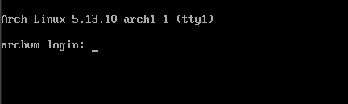
</div>


Ponemos nuestro usuario y contraseña y ya hemos terminado con la instalación del Sistema Operativo.


# Conectándonos a Internet (de nuevo)

Sí, ya sé que nos habíamos conectado a internet antes con `iwctl`, pero eso fue en el instalador, ahora si ya tenes el PC conectado por cable, podés continuar. Sino quedate que vamos a conectarnos al WiFI. <br>
Network Manager nos ofrece `nmcli` para conectarnos al WiFi. Si por ejemplo nuestra Red Wifi se llama `Batman` y la contraseña es `B4timovil`:


```sh
nmcli device wifi list ## Listar las redes disponibles
nmcli device wifi connect Batman pasword B4timovil
```

Si tu Red WiFi o contraseña tiene espacios, ponela entre comillas.


# Comandos útiles

Ya tenemos una bella, hermosa, y muy poco intuitiva terminal. <br>
Por eso te voy a dejar acá algunos comandos útiles. <br>
No te olvides que de todas formas google existe!. <br>

```sh
ping archlinux.org ## Comprobar si tenemos conexión a internet
reboot ## Reiniciar
shutdown now ## Apagar
ls -l ## Listar todos los archivos del directorio actual
cd <nombreDirectorio> ## Cambiar de directorio
cd .. ## Volver hacia atrás
cd ~ ## Ir a la carpeta home
pwd ## Saber en qué directorio estás
cat <nombreArchivo> ## Leer un archivo de texto


CTRL + C ## Para parar una ejecución
```

# Instalando Yay

A veces los repositorios oficiales de Arch Linux (esos que usa `pacman` para descargar cosas) no tienen todo lo que queremos (Y sinó hace un `sudo pacman -S google-chrome` y fijate que pasa). <br>
Por eso hay repositorios de la comunidad (AUR) que nos van a facilitar la vida. En nuestro caso vamos a usar [Yay](https://github.com/Jguer/yay). <br>
Para poder instalarlo tenemos que ejecutar esta secuencia de comandos:

```sh
sudo pacman -Syu
cd /opt
sudo pacman -S git
sudo git clone https://aur.archlinux.org/yay-git.git
sudo chown -R batman:batman ./yay-git ## Reemplaza batman por tu usuario
cd yay-git
makepkg -si ## Se compilará e instalará
cd ~ ## Volvemos a nuestro home

```

Y con esto ya podemos instalar paquetes con `yay`. <br>
Lo bueno es que tiene casi las mismas opciones que `pacman` <br>
Entonces, lógicamente para instalar un paquete con `yay` tenemos que ejecutar:

```sh
yay -S <nombrePaquete> ## Mirá que no puse sudo
```

Y para actualizar todos los paquetes... sí, adivinaste:

```sh
yay -Syu
```

# Instalando un Entorno de Escitorio

Arch Linux viene pelado, le tenemos que instalar un entorno de escritorio para poder usarlo. <br>
Te dejo algunos que seguro ya conocés de otras distribuciones, pero tené en cuenta que hay más y que hay todo un mundo y una vez que entrás ya no podés salir (googleá `qtile`, `xmonad`, `i3`, etc)

## KDE Plasma

Al principio es feo como golpearse el dedo chiquito del pie con la pata de la cama, pero con un poco de amor puede quedar muy bien.


```sh
sudo pacman -S xorg ## Gestiona la comunicación con los distintos periféricos ynuestro SO
sudo pacman -S plasma-meta kde-applications-meta ## Instalamos KDE Plasma
sudo systemctl enable sddm ## Habilitamos el servicio que nos permitirá loguearnos en el siguiente inicio
reboot
```
Paciencia, esto va a tardar un rato.

Si por algun motivo, ves que aparece algo como esto:

```sh
WARNING: Possible missing firmware for moudule: wd719x
WARNING: Possible missing firmware for moudule: aic94xx
WARNING: Possible missing firmware for moudule: xhci_pci
```
No te hagas problema que lo solucionamos más tarde.


<br><br><br><br><br><br><br><br><br>
<br><br><br><br><br><br><br><br><br><br><br><br><br><br><br><br><br><br><br><br><br><br><br><br><br><br><br><br><br><br><br><br><br><br><br><br><br><br><br><br><br><br><br><br><br>